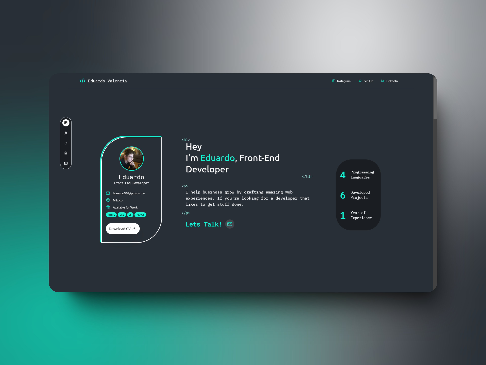

### Eduardo Valencia's Portfolio

Welcome to my personal portfolio website, built with **Astro** and **Tailwind CSS**. This project highlights my work, skills, and experience in web development and design.


## 🚀 Project Structure
```
/
├── public/
│   └── img/
├── src/
│   ├── components/
│   │   ├── common/
│   │   ├── layout/
│   │   └── sections/
│   ├── icons/
│   │   ├── About.astro
│   │   ├── App.astro
│   │   ├── Back-End.astro
│   │   ├── Code.astro
│   │   ├── CSS.astro
│   │   ├── Download.astro
│   │   ├── Front-End.astro
│   │   ├── GitHub.astro
│   │   ├── H1.astro
│   │   └── ...
│   ├── layouts/
│   │   └── Layout.astro
│   ├── pages/
│   │   └── index.astro
│   └── env.d.ts
├── astro.config.mjs
├── tailwind.config.mjs
├── tsconfig.json
├── package.json
└── README.md
```


## 🛠 Technologies Used
- **Astro**: Static site builder
- **Tailwind CSS**: Utility-first CSS framework
- **TypeScript**: Type safety
- **Fontsource**: Self-hosted fonts
- **Vercel**: Deployment platform

## 📦 Installation
1. Clone the repository:
    ```
    git clone https://github.com/Obskurath/portfolio-dev.git
    cd portfolio-dev
    ```
2. Install dependencies:
    ```
    npm install
    ```

### 🚀 Development
Start the development server:
    ```
    npm run dev
    ```
The site will be available at [http://localhost:4321](http://localhost:4321).

### 🏗️ Production Build
Build the project for production:
    ```
    npm run build
    ```
This generates static assets in the `dist` directory.

### 🔍 Previewing the Build
Preview the production build locally:
    ```
    npm run preview
    ```

## 📁 Project Details

### Components
- **Common Components**: Reusable elements located in the `common` folder.
- **Layout Components**: Layout elements in the `layout` folder.
- **Sections**: Various page sections in the `sections` folder.

#### Swiper Implementation
Located in `src/components/swiper/`:
- **ProjectsSwiper.astro**: Main swiper component that displays project cards
- **ProjectCard.astro**: Individual project card component
- **projects.ts**: Project data configuration

```typescript
// Example [projects.ts] structure:
export const projects = [
  {
    title: "SoundHub Discord Bot",
    description: "A feature-rich Discord bot that plays music from YouTube.",
    image: "/img/soundhub.png",
    github: "https://github.com/yourusername/soundhub"
  },
  // ...more projects
];
```

### Icons
SVG icons like:
- `About.astro`
- `GitHub.astro`
- `LinkedIn.astro`


### Pages
The main page, `index.astro`, imports various sections:
```bash
import Layout from "@layouts/Layout.astro";
import HomeSection from "@components/sections/HomeSection.astro";
import AboutMeSection from "@components/sections/AboutMeSection.astro";
import SkillsSection from "@components/sections/SkillsSection.astro";
import ProjectsSection from "@components/sections/ProjectsSection.astro";
import ContactSection from "@components/sections/ContactSection.astro";
```

### 🎨 Styling and Fonts
- **Tailwind CSS**: Configured in `tailwind.config.mjs`.
- **Fonts**: Using IBM Plex Mono and Ubuntu via `@fontsource`.


### 🌐 Deployment
Deployed on **Vercel**, with automatic deployments triggered by pushes to the `main` branch.


### 🐞 Troubleshooting
Check for:
- **Missing Props**: Ensure all required props are passed to components.
- **Unused Imports**: Remove any unused imports.
- **Type Errors**: Run `astro check` to find and fix TypeScript issues.


## 🧞 Commands Reference
| Command                | Action                                      |
|------------------------|---------------------------------------------|
| `npm install`          | Installs dependencies                       |
| `npm run dev`          | Starts local dev server at `localhost:4321` |
| `npm run build`        | Builds the production site to `dist`        |
| `npm run preview`      | Previews the build locally before deploying |
| `npm run astro ...`    | Runs Astro CLI commands                     |
| `npm run astro -- --help` | Displays help for the Astro CLI          |

## 📸 Preview



## 📫 Contact
- **Email**: [EduardoVG@proton.me](mailto:EduardoVG@proton.me)
- **GitHub**: [Obskurath](https://github.com/Obskurath)
- **LinkedIn**: [Eduardo Valencia](https://www.linkedin.com/in/eduardo-valencia)

## 🤝 Contributing

Special thanks to [Johann Leon](https://dribbble.com/johannleon2025) for the design.

## 📄 License
This project is open-source and available under the [MIT License](LICENSE).
